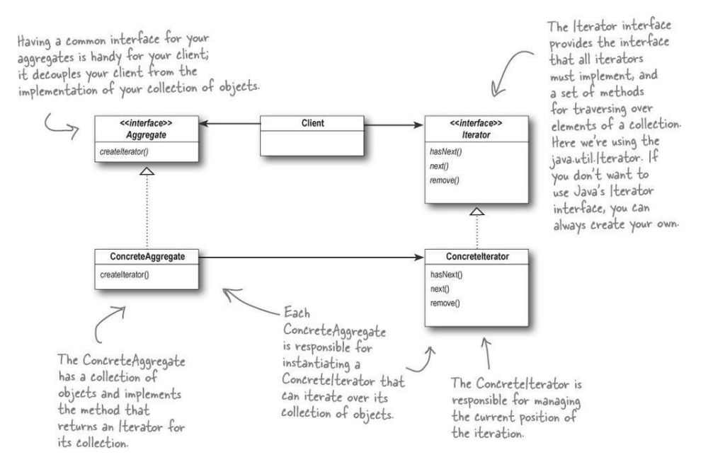

# The Iterator Pattern

Provides a way to access the elements of an aggregate object sequentially without exposing its underlying representation.

## Why?

Gives you a way to step through the elements of an aggregate without having to know how things are represented under the covers.

The effect of using iterators in your design is just as important

* Once you have a uniform way of accessing the elements in all your aggregate objects, you can write polymorphic code that works with *any* of these aggregates.
* The Iterator Pattern takes the responsibility of traversing elements and gives that responsibility to the iterator object, and not the aggregate object.
    * Keeps the aggregate interface and implementation simpler
    * Removes the responsibility for iteration from the aggregate, keeping it focussed on the things it should be focussed on. i.e. managing a collection of objects, not on iteration.

## Diagram

**Note** remove() is part of the java.util.Iterator

## Design Principle

**Single Responsibility** - A class should have only one reason to change.

If we allow a class to not only take care of its own business (managing some kind of aggregate in this case), but also take on more responsibilities (like iteration), then we have given it two reasons to change in the future.

This is the 'S' in SOLID.

*However*, separating responsibility in design is one of the most difficult things to do, so examine your designs and watch out for signals that a class is changing in more than one way as your system grows.

**Cohesion** is a term that you will hear used as a measure of how closely a class or a module supports a single purpose or responsibility.

We say that a module or class has *high cohesion* when it is designed around a set of related functions, and *low cohesion* when it is designed around a set of unrelated functions.

## Questions

### Other sources include the methods first(), next(), isDone() and currentItem(). What's going on?

These are the 'classic' methods names. Iterator has evolved!

### What are 'internal' iterators and 'external' iterators?

We implemented an external iterator, meaning the client controls the iteration by calling Next(). An internal iterator is controlled by the iterator itself, so because it's the iterator stepping through the elements, you have to tell the iterator what to do with each element.

That means you need a way to pass an operator to your iterator. Internal iterators can be easier to use, but they can also be less flexible.

### Can iterators go backwards as well as forwards?

Yes. You will need to add methods to get to the previous element and to tell when you have reached the beginning of the aggregate.

### What defines the ordering for collections like Hashtable?

Iterators imply no ordering. In general you should make no assumptions about ordering unless documentation say otherwise.

### What is polymorphic iteration?

When we write methods that take iterators as parameters, we are using polymorphic iteration. That means we are creating code that can iterate over any collection as long as it supports iterator.

